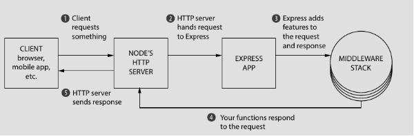

# EXPRESS.JS NOTES

## 1. Express.js

### Introduction

Express is a small web framework that runs on top of Node and itself is an intentionally barebones and unopinionated framework meaning it allows us to do many things how we want, and to extend it with only the features we need. It helps to simplify the Node.js’s web API functionality and add other features. It helps to organize web application through routing and middlewares.

Express add two big features on top of Node.js HTTP server:

* It adds abstraction layer to a lot of complexity by providing number of helpful functions or conveniences. Example: Sending a single JPEG file in raw Node.js requires extensive,  performance-optimized code (~45 lines). In Express, this is reduced to a  one-line sendFile method.
* It augments Node.js's capabilities with utilities like easier parsing of request URLs, direct access to the client's IP address, simplified response methods



> Figure 1.1 : The Flow of a request through Express

The flow of a request in an Express application (as show in figure 1.1) involves several layers of modular functionality:

1. The client (browser or mobile app) sends a request.
2. The Node.js HTTP server receives the request and hands it to Express.
3. Express processes the request through a middleware stack:
   - Middleware functions handle logging, parsing, or other general tasks.
   - Specific route handlers respond to requests for particular URLs or endpoints.
4. Once processed, the response is sent back to the client.

This layered, modular approach improves flexibility and readability compared to a single large request handler.

### Summary

---

## 2. ENVIRONMENT VARIABLES

### Introduction

Enivronment variables are variables that are specific to individual environment. They are useful to important  information in key-value pairs outside of the source code of the project. These values are access by application during runtime. These variables are mainly used for:

* Providing different values for different environments like development, testing, production so that we do not have to modify our project code.
* Storing vital secrets such as keys, database passwords or username, etc.
* Settings for hosting like host, ports etc

 These environment variables are crucial to be hidden from hackers or leechers as they contain major information that could compromise the security of the project. The files containing these variables even should never be shown to others or even commit to Github.

### Configuring Environment Variables

There are multiple ways to store configure environment variables but only three methods are discussed. These methods are mostly used during development, testing of project.

* #### OS level configuration

The first method of configuring environment variables is using the shell command `export`, which will save environment variables and their values to the current shell session. To overwrite any variables, just rerun `export` with the new values for those variables. Also, our environment variables will be lost when we terminate the shell. The `printenv` command displays all the environment variables present in terminal.  This is difficult if we had lots of variables.

```bash
export NODE_ENV=prod PORT=3000 HOST=localhost
```

> Note: The environment variables are stored in capital snake case, called `SCREAMING_SNAKE_CASE` or `SHOUTING_CASE` with equals to assignment operator with no space around it.

* #### Standard Node.js configuration

In Node, using `dotenv` package to handle environment variables is the standard way.  The `dotenv` package can be installed from npm and is stored as dependencies.

```bash
npm i dotenv
```

These variables are used to store in `.env` file in Node.js. This file is kept in root of our project folder and must be added in `.gitignore` limiting to our local machine. Example of variables stored in `.env` is given below:

```.env
NODE_ENV=dev
PORT=3000
HOST=localhost
```

* #### Production configuration

The above two configuration can only be used for development, testing and local deployment purposes. The `.env` files are not used in web hosting. In production different hosting services provide dashboard that have `.env` section in hosting where we can configure it but otherwise, always check their documentation! It can also be configured using docker, VPS, CI/CD pipeline, etc.

### Accessing Environment Variables

Node.js provides built-in `process` object to access environment variables through its `env` property. Node will load each environment variable to the `process.env` object, using its name as the property. But first `dotenv` should always be loaded with its `config` method invoked. For Example:

```javascript
import dotenv from "dotenv";
dotenv.config(/*{path: "path/to/env/file"}*/);

function required(key: string): string {
  const value = process.env[key];
  if (!value) throw new Error(`Missing env variable: ${key}`);
  return value;
}

export const ENV = {
  PORT: parseInt(required("PORT")),
  HOST: required("HOST"),
  NODE_ENV: process.env.NODE_ENV || "development",
};

```

> Note: The `.env` variables are always string and no hardcoding of those values should be done into the source code.

### Summary

1. Environment variables are accessed at runtime for different configuration of environments, stores important settings in key-value format
2. These variables are stored in `.env` file and never be shown to others. Also, `.gitignore` must hide it from git commits
3. `export` is used to create and update environment variables in shell. These exist temporarily for single terminal session.
4. In Node.js projects, the standard approach during development is to use the `dotenv` package to load variables from a `.env` file into `process.env`.
5. In production environments, `.env` files are typically not used directly. Instead, environment variables are configured through hosting dashboards, Docker, VPS configuration, or CI/CD pipelines.
6. In Node.js, environment variables are accessed via the built-in `process.env` object, and since all values are strings, proper validation and type conversion should always be performed before using them in the application.

---

<!-- 

## 3. ROUTING 

### Introduction

### Summary

-->
<!-- 

## 4. MIDDLEWARES 

### Introduction

### Summary

-->
<!-- 

## 5. REQUEST AND RESPONSE 

### Introduction

### Summary

-->
<!-- 

## 6. BUILDING API 

### Introduction

### Summary

-->
<!-- 

## 7. MODELS & ORMS 

### Introduction

### Summary

-->
<!-- 

## 8. FORMS AND VALIDATION 

### Introduction

### Summary

-->
<!-- 

## 8. JSON WEB TOKEN 

### Introduction

### Summary

-->