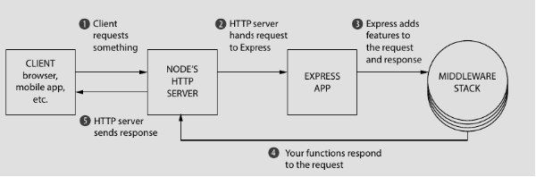
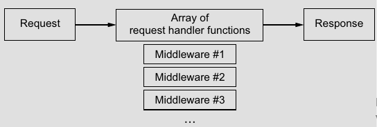

# EXPRESS.JS NOTES

## TABLE OF CONTENTS

* [I. EXPRESS](#i-express)
  + [Introduction](#introduction)
  + [The Core Parts Of Express](#the-core-parts-of-express)
  + [The Mandatory Hello-World Program](#the-mandatory-hello-world-program)
  + [Summary](#summary)
* [II. ENVIRONMENT VARIABLES](#ii-environment-variables)
  + [Introduction](#introduction-1)
  + [Configuring Environment Variables](#configuring-environment-variables)
  + [Accessing Environment Variables](#accessing-environment-variables)
  + [Summary](#summary-1)
* [III. ROUTING](#iii-routing)
  + [Introduction](#introduction-2)
  + [Routing in Express](#routing-in-express)
  + [Routers](#routers)
  + [Summary](#summary-2)
* [IV. MIDDLEWARES](#iv-middlewares)
  + [Introduction](#introduction-3)
  + [Static Server Middleware](#static-server-middleware)
  + [Controller Function](#controller-function)
  + [404 Handler Middleware](#404-handler-middleware)
  + [Error Handling Middleware](#error-handling-middleware)
  + [Other Useful Middleware](#other-useful-middleware)
  + [Summary](#summary-3)
* [REFERENCES](#references)

---

## I. EXPRESS

### Introduction

Express is a small web framework that runs on top of Node and itself is an intentionally barebones and unopinionated framework meaning it allows us to do many things how we want, and to extend it with only the features we need. It helps to simplify the Node.js’s web API functionality and add other features. It helps to organize web application through routing and middlewares.

Express add two big features on top of Node.js HTTP server:

* It adds abstraction layer to a lot of complexity by providing number of helpful functions or conveniences. Example: Sending a single JPEG file in raw Node.js requires extensive,  performance-optimized code (~45 lines). In Express, this is reduced to a  one-line sendFile method.
* It augments Node.js's capabilities with utilities like easier parsing of request URLs, direct access to the client's IP address, simplified response methods



> Figure 1.1 : The Flow of a request through Express

The flow of a request in an Express application (as show in figure 1.1) involves several layers of modular functionality:

1. The client (browser or mobile app) sends a request to the server.
2. The Node.js HTTP server receives the request and hands it to Express.
3. Express processes the request through a middleware stack:
   + Middleware functions handle logging, parsing, or other general tasks.
   + Specific route handlers respond to requests for particular URLs or endpoints.
   + We add our custom made middlewares such as controllers, validators, etc in the middleware stack
4. Once processed, the response is sent back to the client.
5. The response is sent through the Node's HTTP server response by Express again.

This layered, modular approach improves flexibility and readability compared to a single large request handler of Node's HTTP sever.

### The Core Parts Of Express

An Express app, at high level has four main features:

#### 1. Routing

Routing is a mechanism that maps requests to specific endpoint depending on their URL and HTTP methods. The client's requests are handled with function that gets triggers only when we visit a specific URL with a specific HTTP method. It is achieved by a function called router. For example, request `GET /`  is mapped and returns the homepage through a middleware function.

#### 2. Middlewares

Middlewares are the functions that handles processing of the server request and sending desired response. They handle several tasks from logging of request to setting static files and many more. Express has middleware stack that which  is effectively an array of functions that handles request.

#### 3. Sub-applications

A sub-application is a combination of middlewares and routes helping us to achieve task requested by the client. These are the subdivision of an Express application divided into different smaller apps such as handling APIs, rendering HTML files, sending static files, etc.

#### 4. Views

Views in Express are the dynamically rendered HTML files. Express allows numerous view engines like Pug, EJS (Embedded JavaScript), Handlebars, and more. They helps us to change and send out HTML on the fly.

### The Mandatory Hello-World Program

```javascript
import express from "express";

const app = express()
const port = 3000

app.get('/', (req, res) => {
  res.send('Hello World!')
})

app.listen(port, () => {
  console.log(`Example app listening on port ${port}`)
})
```

The given program is an example of simplest express application and the whole program is described below in a step-wise format.

1. The express package is imported in the beginning
2. `app` variable then initailizes the express application.
3. `port` holds the port number that the sever will be hosted on
4. `app.get()` is a router function that maps `GET` method of `/` URl.
5. The callback function inside `app.get()` is a middleware function that sends a response of  a HTML file with "Hello World" text in its body
6. `app.listen` method is used to start sever at given port and also takes an arrow function that logs if server is successfully started.

### Summary

1. Express is a flexible, non-strict web framework that built as an extension of Node's HTTP library, adding abstractions and simplifying response methods.
2. The client request is handled by express app through middlewares, flown as Node's HTTP server request and response objects.
3. Express has four main features:
   + Routing: mapping of URL and HTTP methods
   + Middlewares: an array functions that take request and send response triggered by a router
   + Sub-applications: Different smaller application budled together by routes and middlewares
   + Views: Sends dynamic HTML files via templating engine

---

## II. ENVIRONMENT VARIABLES

### Introduction

Enivronment variables are variables that are specific to individual environment. They are useful to important  information in key-value pairs outside of the source code of the project. These values are access by application during runtime. These variables are mainly used for:

* Providing different values for different environments like development, testing, production so that we do not have to modify our project code.
* Storing vital secrets such as keys, database passwords or username, etc.
* Settings for hosting like host, ports etc

 These environment variables are crucial to be hidden from hackers or leechers as they contain major information that could compromise the security of the project. The files containing these variables even should never be shown to others or even commit to Github.

### Configuring Environment Variables

There are multiple ways to store configure environment variables but only three methods are discussed. These methods are mostly used during development, testing of project.

#### 1. OS level configuration

The first method of configuring environment variables is using the shell command `export`, which will save environment variables and their values to the current shell session. To overwrite any variables, just rerun `export` with the new values for those variables. Also, our environment variables will be lost when we terminate the shell. The `printenv` command displays all the environment variables present in terminal.  This is difficult if we had lots of variables.

```bash
export NODE_ENV=prod PORT=3000 HOST=localhost
```

> Note: The environment variables are stored in capital snake case, called `SCREAMING_SNAKE_CASE` or `SHOUTING_CASE` with equals to assignment operator with no space around it.

#### 2. Standard Node.js configuration

In Node, using `dotenv` package to handle environment variables is the standard way.  The `dotenv` package can be installed from npm and is stored as dependencies.

```bash
npm i dotenv
```
  
These variables are used to store in `.env` file in Node.js. This file is kept in root of our project folder and must be added in `.gitignore` limiting to our local machine. Example of variables stored in `.env` is given below:

```.env
NODE_ENV=dev
PORT=3000
HOST=localhost
```

#### 3. Production configuration

The above two configuration can only be used for development, testing and local deployment purposes. The `.env` files are not used in web hosting. In production different hosting services provide dashboard that have `.env` section in hosting where we can configure it but otherwise, always check their documentation! It can also be configured using docker, VPS, CI/CD pipeline, etc.

### Accessing Environment Variables

Node.js provides built-in `process` object to access environment variables through its `env` property. Node will load each environment variable to the `process.env` object, using its name as the property. But first `dotenv` should always be loaded with its `config` method invoked. For Example:

```javascript
import dotenv from "dotenv";
dotenv.config(/*{path: "path/to/env/file"}*/);

function required(key: string): string {
  const value = process.env[key];
  if (!value) throw new Error(`Missing env variable: ${key}`);
  return value;
}

export const ENV = {
  PORT: parseInt(required("PORT")),
  HOST: required("HOST"),
  NODE_ENV: process.env.NODE_ENV || "development",
};
```

> Note: The `.env` variables are always string and no hardcoding of those values should be done into the source code.

### Summary

1. Environment variables are accessed at runtime for different configuration of environments, stores important settings in key-value format
2. These variables are stored in `.env` file and never be shown to others. Also, `.gitignore` must hide it from git commits
3. `export` is used to create and update environment variables in shell. These exist temporarily for single terminal session.
4. In Node.js projects, the standard approach during development is to use the `dotenv` package to load variables from a `.env` file into `process.env`.
5. In production environments, `.env` files are typically not used directly. Instead, environment variables are configured through hosting dashboards, Docker, VPS configuration, or CI/CD pipelines.
6. In Node.js, environment variables are accessed via the built-in `process.env` object, and since all values are strings, proper validation and type conversion should always be performed before using them in the application.

---

## III. ROUTING

### Introduction

Routing is the process where a server maps the HTTP verbs and URIs to specific methods that generates response to the client request. A basic example is when we visit `example.com/client` in browser. The raw HTTP request and the controller function looks like:

```http
GET /client http/1.1
```

```javascript
app.get("/clients",function(request, response){
  response.send("Welcome to client page");
});
```

The request has a HTTP verb (GET), a URI (`/client`) and the HTTP version 1.1. The server maps URI and HTTP method to specific controller. The `app.get()` here has a controller function which is triggered by server for the given request. The controller generates and sends a response, here a HTML file with "Welcome to clientpage" in the body, to the client.

### Routing In Express

In Express.js, routing is achieved by defining routes using methods like `app.get()`, `app.post()`, `app.put()`, and `app.delete()`. Each route consists of a **path** and one or more **handler functions** (middlewares).

```javascript
app.get("/path", function(){
  res.send("This is one of the middleware function")
});
```

#### Grabbing route parameters

We can pass variables in the route paths, these variables are called route parameters as well as path variables. In Express, this can be achieve in a very simple way by just putting a full colon(':') in front of the variable name.

```javascript
app.get("/clients/:cid/:dt",function(req, res){

  let client_id = parseInt(req.params?.cid);
  let date = req.params?.dt;

  // Other code ...

});
```

The `req.params` object of Express maps & stores all the variables for the path, however, the value is always in string type.

#### Grabbing query parameter

The query arguments which we pass through url after '?' is available in query object of request i.e.  `req.query`.

```http
GET /search?fruit=apple
```

```javascript
app.get("/search", async function(req, res){

  let fruitSrch = req.query?.fruit;

  // Other code...

});
```

> The `request` object, here `req`, will be discussed in [V. REQUEST & RESPONSE] chapter.

#### Matching route with regular expressions

Express allows regex based routes.

```javascript
app.get(/^\/product\/[0-9]+$/, (req, res) => {
  res.send("Product with numeric ID");
});
```

This matches `/product/123` but not `/product/abc`.

### Routers

Routers are the functions in Express that enables us to split routes. This achieves standard and structure in our code. Express gives flexibility to define routes from different places in the app, unlike Django where routes are defined in a single file (urls.py).

For the standard, we will be defining routes in `routes` folder. In this project, we will be defining route for api version 1 so it will be in `backend/src/v1/routes/` folder.

```javascript
// this is app.js
import express from 'express';

// Routers
import apiVersion1 from 'v1/routes/version1.js';

let app = express();

app.use("/v1/api", apiVersion1); //similarly,
// app.use('/v2', apiVersion2); // if version 2

// Other code ...
```

```javascript
// this is v1/routes/version1.js
import { Router } from 'express';
let api = Router();

api.route("/client")
  .get(/*, middlewares1, middleware 2, ... ,*/
    function(req, res)=>{
    res.send("response for /v1/api/client")
});

exports default api;
```

> We can futher split routes with the help of routers, similarly as example.

### Summary

1. Routes can be mapped to simple string or regular expressions and can have variables.
2. `request.params` & `request.query` helps us to get path variable and query parameter respectively in Express.
3. Routes can be defined anywhere in Express, but it is standard to define routes inside `routes` folder specific to version.
4. We can split routes with the use of `Router`.

---

## IV. MIDDLEWARES

### Introduction

Middlewares are the functions are core to Express as they handle request and responses. Express helps request objects pass through the array of functions that acts as a stack for request processing which we call middleware stack.

Express executes middlewares in order we define. This means that the sequence we add middleware in the stack matters for a well generated response.



> Figure 4.1: Array of middleware functions

The middleware function generally takes three arguments: request, response and next as shown in figure below. The `request` and `response` represents the HTTP request and response objects but the `next` function passes the request processing to next middleware in the stack.


> Figure 4.2 Middleware function with three arguments

We use middleware by registering it with `app.use()` for global execution or attaching it directly to specific routes.

```javascript
const express = require('express');
const app = express();

// Custom middleware
const logger = (request, response, next) => {
  console.log(`${req.method} ${req.url}`);
  next(); // pass control to next middleware
};

// Use middleware globally
app.use(logger);

// Route specific middleware
app.get('/', (request, response) => {
  res.send('Hello World');
});
```

Every middleware function must be returned by the `next()` or `response.end()`. The `next()` transfers the flow of program to next middleware in the stack. The `response.end()` ends the response handling and again Node runtime bundles the response into bytes and sends it to user.

If we don’t use `next()` or `response.end()` the request will stuck endlessly as it is not resolved. `response.end()` is a must at the end, we can use similar function such as `response.send()` or `response.sendFile()` that calles `response.end()` internally.

### Controller Function

For a Model-View-Controller (MVC) architecture pattern,controllers are the type of middlewares in the middleware stack that handles business logic and end with a reponse. This could involve working with databases, making calculations or processing through different service functions. It mostly ends the middleware stack if no error occured.

### Error Handling Middleware

There is also a special type of middleware that handles errors. It handles all the error that comes down from other middlewares, thrown by Express app. When a regular middleware encounters a runtime error, Express ignores all the middlewares in the stack and jumps right into the error-handling middleware.


> Figure 4.3 Trigerring of error handling middleware

The error-handling middleware function, unlike other middleware has 4 arguments: error, request, response and next. The extra argument `error` holds the error object thrown by the previous middleware. It also ends with `next()` or `response.end()`.

### 404 Handler Middleware

The 404 handler middleware is the simplest type of function that handles the request that handles routes that does not exist.

Example:

```javascript
app.use((req, res, next) => {
    res.status(404).json({error: "Not Found", message: "The requested resource could not be found."});
});
```

The 404-handler middleware is kept at the last piece of middleware of the express application. It acts as fallback of request for unmatched routes.

### Static Server Middleware

The static middlewares serve the static files such as images, css, js, etc from the server. Express has built-in static middlware i.e. `express.static()`.

```javascript
// for "project/backend/public/"
const publicDir = path.resolve(__dirname, ‘backend/pubilc’);
app.use(express.static(publicDir));
```

The static middleware shares every files of `<project_directory>/backend/public/` folder as publicDir is the path of the pubic folder inside project folder. Here, the express setups public directory when the server is running. After each request to access public files, the server searches the public directory if not found then transfers it to 404 middleware as it won’t throw any error.

### Other Useful Middleware

In Express, beyond basic middleware usage, there are many commonly used third-party and built-in middlewares that handle specific tasks in real-world applications.

* Helmet: Security middleware that protects apps by setting safe HTTP headers.

* Cors: Allows or restricts cross-origin requests when your frontend and backend run on different domains.

* Morgan: Logs incoming requests for debugging and monitoring.

* cookie-parser: Reads cookies and express-session manages user sessions, which is useful for authentication systems.

* Multer: Multer processes multipart/form-data when dealing with file uploads.

* express-rate-limit: prevents abuse by limiting repeated requests.

### Summary

---

<!-- 

## 5. REQUEST AND RESPONSE 

### Introduction

### Summary

---
-->

<!-- 

## 6. VIEWS

### Introduction

### Summary

--->

<!--

## 6. BUILDING API 

### Introduction

### Summary

---
-->

<!-- 

## 7. MODELS & ORMS 

### Introduction

### Summary

---
-->

<!-- 

## 8. FORMS AND VALIDATION 

### Introduction

### Summary

---
-->

<!-- 

## 8. JSON WEB TOKEN 

### Introduction

### Summary

---
-->

## REFERENCES

* [Express](expressjs.com "Node.js web application framework")
* [The Odin Project](theodinproject.com/paths/full-stack-javascript/courses/nodejs "Nodejs course")
* [Express In Action](amazon.com/Express-Action-Writing-building-applications/dp/1617292427 "Book by Ethan Hahn")
* [Chatgpt](chatgpt.com, "an LLM AI model")

---
